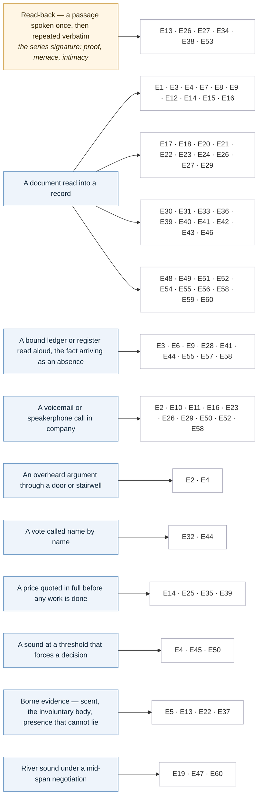
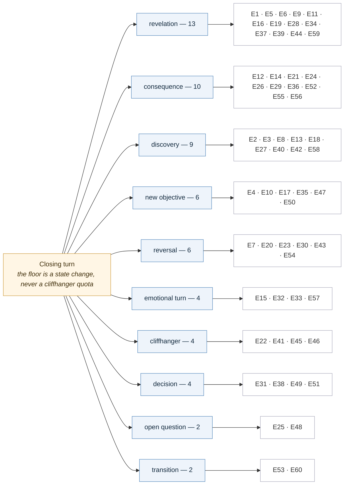
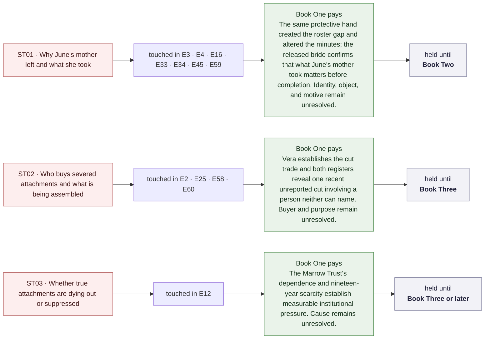

# Book One — Narrative Flow Atlas

Generated from `WorldState/BookCodex.json`, `WorldState/BookOneEpisodeMap.json`,
`WorldState/ContinuityLedger.json` and `WorldState/AudioProductionBible.json`.
Every node label is taken from those files rather than restated by hand, so this file is a *view*
of canon and never an authority over it. Regenerate rather than hand-edit.

Six left-to-right flowcharts:

1. [The episode spine](#1-the-episode-spine) — all sixty episodes, POV, and closing-turn type
2. [Plot lines](#2-plot-lines) — book threads, series threads, and mini-arcs as lanes
3. [The clause spine](#3-the-clause-spine) — obligations from creation to defeat
4. [Devices](#4-devices) — the audio reveal channels and where each one carries an episode
5. [Closing turns](#5-closing-turns) — hook variety across the arc
6. [Protected mysteries](#6-protected-mysteries) — what Book One pays and what it holds

---

## 1. The episode spine

**Central dramatic question.** Can June survive and defeat the first tranche of the Articles without surrendering her consent, and choose what the half-spoken vow will mean on her own terms?

`E` nodes are episodes. Violet nodes are Elias viewpoint, blue are June, gold are the arc's
load-bearing turns. The second label line is the mapped closing turn — the state change the episode
is required to deliver.

What each movement is for, from `movement_milestones`:
- **Movement One (E1–E12) · Setup and disruption** — The half-vow lands immediately; June defeats clause one's residence demand, finds the seven-bride ledger, meets Tess, and learns the Trust needs a completed attachment.
- **Movement Two (E13–E24) · Escalation and rising cost** — June begins deliberate borne-record literacy, loses work, compromises Elias through Kearse, and fails to keep Milo from becoming surety.
- **Movement Three (E25–E36) · Reversal and transformation** — June rejects the cut, learns the Articles are sincere, loses the Hall vote, returns her safe-room slot, and survives the moon only by asking for help.
- **Movement Four (E37–E48) · Consequence and convergence** — Cyd learns the truth, the third holder and altered term surface, Delisle refuses, forfeiture takes Milo, and Elias gives June his complete motive.
- **Movement Five (E49–E60) · Final escalation, climax, and denouement** — June chooses the third outcome, files Tess's case, strikes three clauses, records all prices, and states her continuing election before the small severance sting.

---

## 2. Plot lines

Each lane is one tracked thread, containing only the episodes where the map records an action on it.
`opened` is the left edge, `resolved` the right. The ceiling is seven concurrent open threads, of
which at most three are protected series mysteries.

```mermaid
flowchart LR
  classDef bk fill:#eaf3ea,stroke:#4c8a4c,color:#16301a;
  classDef sr fill:#fdeeee,stroke:#b35a5a,color:#3d1616;
  classDef ma fill:#f2f2f7,stroke:#7a7a99,color:#22223a;
  subgraph BT01["BT01 — The half-spoken vow, Elias's motive, and June's election"]
    direction LR
    BT01_01(["1<br/><b>open</b>"])
    BT01_02["2"]
    BT01_05["5"]
    BT01_12["12"]
    BT01_20["20"]
    BT01_21["21"]
    BT01_23["23"]
    BT01_26["26"]
    BT01_28["28"]
    BT01_29["29"]
    BT01_31["31"]
    BT01_35["35"]
    BT01_36["36"]
    BT01_37["37"]
    BT01_38["38"]
    BT01_40["40"]
    BT01_43["43"]
    BT01_46["46"]
    BT01_47["47"]
    BT01_48["48"]
    BT01_49["49"]
    BT01_50["50"]
    BT01_51["51"]
    BT01_55["55"]
    BT01_57["57"]
    BT01_59["59"]
    BT01_60(["60<br/><b>RESOLVED</b>"])
    BT01_01 --> BT01_02 --> BT01_05 --> BT01_12 --> BT01_20 --> BT01_21 --> BT01_23 --> BT01_26 --> BT01_28 --> BT01_29 --> BT01_31 --> BT01_35 --> BT01_36 --> BT01_37 --> BT01_38 --> BT01_40 --> BT01_43 --> BT01_46 --> BT01_47 --> BT01_48 --> BT01_49 --> BT01_50 --> BT01_51 --> BT01_55 --> BT01_57 --> BT01_59 --> BT01_60
  end
  class BT01_01,BT01_02,BT01_05,BT01_12,BT01_20,BT01_21,BT01_23,BT01_26,BT01_28,BT01_29,BT01_31,BT01_35,BT01_36,BT01_37,BT01_38,BT01_40,BT01_43,BT01_46,BT01_47,BT01_48,BT01_49,BT01_50,BT01_51,BT01_55,BT01_57,BT01_59,BT01_60 bk;
  subgraph BT02["BT02 — The first tranche, Local Nine's charter, and the third holder"]
    direction LR
    BT02_01(["1<br/><b>open</b>"])
    BT02_03["3"]
    BT02_04["4"]
    BT02_06["6"]
    BT02_07["7"]
    BT02_09["9"]
    BT02_10["10"]
    BT02_17["17"]
    BT02_19["19"]
    BT02_22["22"]
    BT02_24["24"]
    BT02_30["30"]
    BT02_31["31"]
    BT02_32["32"]
    BT02_39["39"]
    BT02_40["40"]
    BT02_41["41"]
    BT02_42["42"]
    BT02_46["46"]
    BT02_49["49"]
    BT02_52["52"]
    BT02_53["53"]
    BT02_54["54"]
    BT02_55["55"]
    BT02_56(["56<br/><b>RESOLVED</b>"])
    BT02_01 --> BT02_03 --> BT02_04 --> BT02_06 --> BT02_07 --> BT02_09 --> BT02_10 --> BT02_17 --> BT02_19 --> BT02_22 --> BT02_24 --> BT02_30 --> BT02_31 --> BT02_32 --> BT02_39 --> BT02_40 --> BT02_41 --> BT02_42 --> BT02_46 --> BT02_49 --> BT02_52 --> BT02_53 --> BT02_54 --> BT02_55 --> BT02_56
  end
  class BT02_01,BT02_03,BT02_04,BT02_06,BT02_07,BT02_09,BT02_10,BT02_17,BT02_19,BT02_22,BT02_24,BT02_30,BT02_31,BT02_32,BT02_39,BT02_40,BT02_41,BT02_42,BT02_46,BT02_49,BT02_52,BT02_53,BT02_54,BT02_55,BT02_56 bk;
  subgraph BT03["BT03 — Tess Renn's eleven-year case"]
    direction LR
    BT03_11(["11<br/><b>open</b>"])
    BT03_18["18"]
    BT03_30["30"]
    BT03_44["44"]
    BT03_47["47"]
    BT03_50["50"]
    BT03_51["51"]
    BT03_52(["52<br/><b>RESOLVED</b>"])
    BT03_11 --> BT03_18 --> BT03_30 --> BT03_44 --> BT03_47 --> BT03_50 --> BT03_51 --> BT03_52
  end
  class BT03_11,BT03_18,BT03_30,BT03_44,BT03_47,BT03_50,BT03_51,BT03_52 bk;
  subgraph ST01["ST01 — Why June's mother left and what she took"]
    direction LR
    ST01_03(["3<br/><b>open</b>"])
    ST01_04["4"]
    ST01_16["16"]
    ST01_33["33"]
    ST01_34["34"]
    ST01_45["45"]
    ST01_59["59"]
    ST01_03 --> ST01_04 --> ST01_16 --> ST01_33 --> ST01_34 --> ST01_45 --> ST01_59
  end
  class ST01_03,ST01_04,ST01_16,ST01_33,ST01_34,ST01_45,ST01_59 sr;
  subgraph ST02["ST02 — Who buys severed attachments and what is being assembled"]
    direction LR
    ST02_02(["2<br/><b>open</b>"])
    ST02_25["25"]
    ST02_58["58"]
    ST02_60["60"]
    ST02_02 --> ST02_25 --> ST02_58 --> ST02_60
  end
  class ST02_02,ST02_25,ST02_58,ST02_60 sr;
  subgraph ST03["ST03 — Whether true attachments are dying out or suppressed"]
    direction LR
    ST03_12(["12<br/><b>open</b>"])
    ST03_12
  end
  class ST03_12 sr;
```

**Book thread closures** (from `thread_ledger.book_threads`):
- **BT01 · The half-spoken vow, Elias's motive, and June's election** — opens B1E01, closes B1E60. Elias gives both motives voluntarily at B1E48; by B1E60 June explicitly chooses to remain the bride while neither answering nor seeking his abandonment, and Elias accepts her boundary.
- **BT02 · The first tranche, Local Nine's charter, and the third holder** — opens B1E01, closes B1E56. Delisle's parish is established as the enforceable third holder at B1E41; clauses one through three are struck at B1E53–B1E55; the peace and charter survive because June declines total invalidation; Marta names and pays loss of office at B1E56.
- **BT03 · Tess Renn's eleven-year case** — opens B1E11, closes B1E52. After its bad-faith theory fails, June cures the standing defect by electing to remain the living bride and timely files the case before Delisle.

### Mini-arcs

Eleven non-overlapping four-to-six-episode units. Each answers a local question while advancing a
book thread, which is what keeps the open-thread count under the ceiling.

```mermaid
flowchart LR
  classDef ma fill:#f2f2f7,stroke:#7a7a99,color:#22223a;
  MA01["MA01 · E1-E6<br/>Something impossible walked into June's deposition and bound itself to her. What was it, what..."]
  MA02["MA02 · E7-E12<br/>Can June satisfy the Articles without surrendering her own front door, and what happened to t..."]
  MA01 --> MA02
  MA03["MA03 · E13-E17<br/>June has been reading one kind of record her whole life. Can she learn to read the other one ..."]
  MA02 --> MA03
  MA04["MA04 · E19-E24<br/>Can June protect Milo from clause two by handling it alone?"]
  MA03 --> MA04
  MA05["MA05 · E25-E29<br/>Will June buy her way out at someone else's expense?"]
  MA04 --> MA05
  MA06["MA06 · E30-E34<br/>Is there bad faith anywhere in this document that June can expose?"]
  MA05 --> MA06
  MA07["MA07 · E35-E40<br/>What does the moon actually cost a woman nobody will house, and what does the truth cost the ..."]
  MA06 --> MA07
  MA08["MA08 · E41-E45<br/>Who has been holding the third copy, and can the vow be taken off the table?"]
  MA07 --> MA08
  MA09["MA09 · E46-E50<br/>When June finally offers to answer, will she be allowed to?"]
  MA08 --> MA09
  MA10["MA10 · E51-E55<br/>Is there a third outcome that is neither the vow nor forfeiture?"]
  MA09 --> MA10
  MA11["MA11 · E56-E60<br/>What does winning cost, and who pays it?"]
  MA10 --> MA11
  class MA01,MA02,MA03,MA04,MA05,MA06,MA07,MA08,MA09,MA10,MA11 ma;
```

- **MA01 (E1–E6)** — By B1E06 she has the mechanics she can verify — his half binds only him, he can be compelled by anyone with standing, she is entirely free, and there are nine clauses running on a timetable nobody will disclose. She still does not know why he did it.
- **MA02 (E7–E12)** — She defeats clause one on an 1871 definition — her first win by wording — and inside the Sewickley house finds the stewards' record of seven brides and four deaths, then meets the sister of the seventh.
- **MA03 (E13–E17)** — She realizes she has been reading scent unconsciously for years and starts doing it on purpose — and the cost lands immediately: a lost client, an endangered friend, and a moon date on the wall she has no safe room for.
- **MA04 (E19–E24)** — No. She is beaten on a technicality and Milo is bound as surety — the clearest cost yet of her belief that she can carry this without help.
- **MA05 (E25–E29)** — She refuses the cutter's price on the record, a documented election both registers note — then discovers his exposure endangers her too, so protecting herself now means protecting him.
- **MA06 (E30–E34)** — No. The Articles are sincere and they worked, and the Hall votes to honor them — but Kenneth Boyle votes no, alone, giving her the first ally who chose her over an institution.
- **MA07 (E35–E40)** — She survives the first moon night for which she has asked for help because she finally stops treating solitary survival as the only acceptable plan; Cyd then learns everything, stays, and loses a contract for it.
- **MA08 (E41–E45)** — Delisle's parish has held it since 1871, and he refuses to witness ever again — which takes the vow off the table and makes forfeiture automatic instead.
- **MA09 (E46–E50)** — No — Elias refuses her, then tells her the whole truth: he acted to stop the clause and because he wanted her, both at once. She gets the answer she has chased for forty-seven episodes and it solves nothing.
- **MA10 (E51–E55)** — Yes. She files Tess's case, which requires her to remain the bride, then defeats clauses one through three on their own terms in front of the woman who wrote them.
- **MA11 (E56–E60)** — Named aloud and paid in full: Milo released, Marta out of office, Kenneth out of the Local, Elias barred from office forever. Three clauses struck. Six left.

---

## 3. The clause spine

The obligation chain from `ContinuityLedger.json`. Boxes are obligations, labelled with the episode
that creates them and their final recorded status. This is the causal machine the plot runs on: each
clause creates the conditions for the next, and the arc ends by making the first three permanently
non-executable without invalidating the instrument.

```mermaid
flowchart LR
  classDef live fill:#eef4fb,stroke:#5588bb,color:#12293d;
  classDef dead fill:#eaf3ea,stroke:#4c8a4c,color:#16301a;
  classDef perm fill:#fff6e5,stroke:#cc9a3d,color:#3d2c08;
  OB001["OB-001 · Elias Marrow's half-vow exposure<br/><i>origin B1E01 — active half bound</i>"]
  OB002["OB-002 · June Havlik as named party under the Articles<br/><i>origin B1E01 — active permanent party after B1E52</i>"]
  OB003["OB-003 · Clause one residence<br/><i>origin B1E01 — permanently non executable</i>"]
  OB011["OB-011 · Clause two surety requirement<br/><i>origin B1E17 — satisfied then permanently non executable</i>"]
  OB012["OB-012 · June's contingent bargain with Kearse<br/><i>origin B1E19 — active</i>"]
  OB013["OB-013 · Kearse's served demand against exposed Elias<br/><i>origin B1E20 — terminated by B1E29 refusal with derivative created</i>"]
  OB018["OB-018 · Kearse's assignable derivative claim<br/><i>origin B1E29 — active</i>"]
  OB014["OB-014 · Milo Havlik's clause-two surety<br/><i>origin B1E24 — released after clause two and three defeat</i>"]
  OB023["OB-023 · Parish custodial presentation duty<br/><i>origin B1E41 — active</i>"]
  OB034["OB-034 · Lionel Kearse's Clause Three invocation petition<br/><i>origin B1E41 — performed</i>"]
  OB024["OB-024 · Clause-three term, completion condition, and forfeiture<br/><i>origin B1E42 — permanently non executable after entry in both records</i>"]
  OB025["OB-025 · Delisle's permanent refusal to witness Article vows<br/><i>origin B1E43 — active personal refusal</i>"]
  OB026["OB-026 · Milo's Articles custody<br/><i>origin B1E46 — released after clause three defeat</i>"]
  OB027["OB-027 · Elias's prepared adverse testimony election<br/><i>origin B1E49 — satisfied by adverse filing</i>"]
  OB028["OB-028 · June's permanent adverse-party election<br/><i>origin B1E52 — active permanent</i>"]
  OB029["OB-029 · Joint adjudication of clauses one through three<br/><i>origin B1E53 — active permanent non execution under original clause nine</i>"]
  OB030["OB-030 · Elias's permanent office disqualification<br/><i>origin B1E55 — active permanent</i>"]
  OB033["OB-033 · June and Elias's revocable working alliance<br/><i>origin B1E60 — active revocable</i>"]
  OB001 -->|"the half-vow names her"| OB002
  OB002 -->|"clause one matures"| OB003
  OB003 -->|"residence satisfied, clause two due"| OB011
  OB011 -->|"she needs a surety defense"| OB012
  OB012 -->|"one scheduling fact"| OB013
  OB013 -->|"refusal creates the derivative"| OB018
  OB011 -->|"Milo accepts in his own words"| OB014
  OB014 -->|"surety entered, term certain runs"| OB024
  OB023 -->|"parish presents the clause"| OB024
  OB034 -->|"Kearse invokes; Delisle verifies"| OB023
  OB024 -->|"no accepted witness"| OB025
  OB025 -->|"forfeiture converts surety to custody"| OB026
  OB026 -->|"Elias prepares adverse testimony"| OB027
  OB027 -->|"June elects to remain the bride"| OB028
  OB028 -->|"the case is filed and heard"| OB029
  OB029 -->|"Elias is barred from office"| OB030
  OB029 -->|"what is left is a chosen alliance"| OB033
  class OB001,OB012,OB018,OB023,OB025,OB033 live;
  class OB013,OB014,OB034,OB026,OB027 dead;
  class OB002,OB003,OB011,OB024,OB028,OB029,OB030 perm;
```

The full ledger carries thirty-four obligations. The ones above are the spine; the rest are the
human-scale costs that hang off it — safe-room money, the promise to Cyd, Milo's thirty-day
restriction, Marta's agency, Kenneth's exile.

---

## 4. Devices

`AudioProductionBible.json` fixes seven reveal channels plus the series signature. Every essential
reveal must arrive as sound, and no channel may run twice in a row. Below, each channel points at the
episodes whose mapped `reveal_channel` it carries.

Two prohibitions govern the rotation, from `WritingStyle.md`: never let a silent visual carry a beat
alone, and reserve verbatim repetition for when the repetition itself means something. The read-back
is strongest where it does double duty — E34 sets June's transcript against the official minutes, and
E20 recites her own sentence back to her with Elias standing inside it.

### Countable anchors

The other running device. Each episode carries at least one number the listener can hold:

```mermaid
flowchart LR
  classDef n fill:#f6eff7,stroke:#9a6fa6,color:#33203a;
  N0["nine clauses<br/><i>the instrument's fixed sequence</i>"]
  N1["1871<br/><i>execution date of the Articles</i>"]
  N0 --> N1
  N2["three copies<br/><i>sealed original, certified counterpart, parish third</i>"]
  N1 --> N2
  N3["311 members<br/><i>what Marta is protecting</i>"]
  N2 --> N3
  N4["nineteen days to nine<br/><i>the altered numeral and the mandatory stay</i>"]
  N3 --> N4
  N5["forty-eight hours<br/><i>the surety dispute stay</i>"]
  N4 --> N5
  N6["three nights<br/><i>the public moon calendar</i>"]
  N5 --> N6
  N7["eleven years<br/><i>Tess's case</i>"]
  N6 --> N7
  N8["seven brides, four graves<br/><i>the house ledger</i>"]
  N7 --> N8
  N9["six left<br/><i>the clauses still standing at the end</i>"]
  N8 --> N9
  class N0,N1,N2,N3,N4,N5,N6,N7,N8,N9 n;
```

---

## 5. Closing turns

Every episode must end on a state change; the *kind* of turn is deliberately varied so the audience
never learns the rhythm. Distribution across the arc:

Four hard cliffhangers in sixty episodes, against nine consequences and eleven revelations. The
machinery the style guide bans — shock, defusal, fresh shock — is absent by construction.

---

## 6. Protected mysteries

Three questions are never resolved early. Book One pays one instalment of proven fact on each and
holds the answer.

---

## Legend

| Shape or colour | Meaning |
| --- | --- |
| Blue rectangle | June viewpoint, or a live obligation |
| Violet rounded | Elias viewpoint |
| Gold | Arc milestone, series signature device, or permanent status |
| Green | Closed, satisfied, or paid |
| Red | Protected series mystery |
| Stadium node | A thread opening or resolving |

Regenerate with the script recorded in `WorldState/CHANGELOG.md` for this file's version. Canon lives
in the three JSON files; this atlas is a reading of them.

